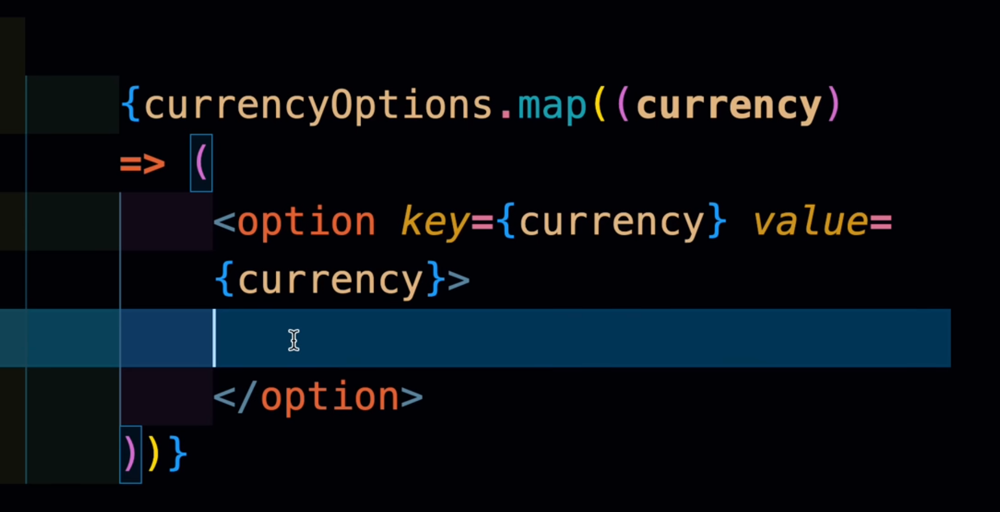

if counter  and counter ++ then variable will not update in ui in reeact
 - in js to change it in different places in ui you will need refrences
 - in react use react hook usestate 

## react fibre
    - react fibre is the reconciliation algorithm that react uses to update the ui
    - it is a tree structure that represents the ui
    - it is used to diff the old and new ui and update only the changed parts
    - it is used to optimize the rendering of the ui

> devui.io

- when [[]] comes in  js documentaion then it means its default value

- props in react --> object destructuring

### interview question

[counter, setCounter] = useState(0)
func increaseCounter=()=>{
    setCounter(counter + 1)
    setCounter(counter + 1)
    setCounter(counter + 1)
    setCounter(counter + 1)
} 
- this will not work as expected because setCounter is asynchronous
- it will only update the counter once and not four times
- because of the way react batches state updates(react fibre)
- to fix this you can use the functional form of setState
```javascript
setCounter(prevCounter => prevCounter + 1)
```
as usestate has a callback function(hidden feature) that takes the previous state as an argument

- `onclick` accepts a function not a value
disabled property in react.

key in loop in react is used to identify which items have changed, are added, or are removed. It helps React optimize the rendering process by keeping track of elements in a list.

### React treats key specially and does not pass it as a regular prop to the child component.
in a tag the whole page is reloaded, in link tag only the part of the page is reloaded.
there is also a `navlink` tag which is used to navigate between pages in a react application.

isActive is a prop in `NavLink` that is used to apply a specific style to the active link. It is used to indicate which link is currently active or selected.


> ### hooks are top level, stateful functions that allow you to use React features without writing a class. They can only be called at the top level of a component or a custom hook, and not inside loops, conditions, or nested functions.

> first letter of comoponent should be capitalized, otherwise it will be treated as a regular HTML element.?(ai)


suppose i have a get joke and post joke network call when i post it it should update the UI with the new joke without needing to refresh the page.---> i gues i will use context, react query or any other soln
basically managing the network state and ensuring the UI is in sync with the server state.


*** Everything is immutable in react ***

### {children} do not re-render even if parent re-renders, unless they have shared state.


